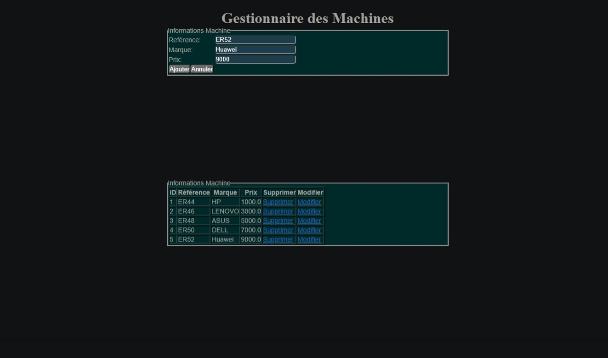

## Projet Java de Gestion de Salles et de Machines

- **Ajoute d'une machine :**

  
## les fonctionnalités implémentées
1. les operations CRUD pour les machines
3. trouver les machines existants

  
##Les Technologies Utilisées
+ MySQL
+ Hibernate
+ JSP

"# TP-JSP-Servlet" 
