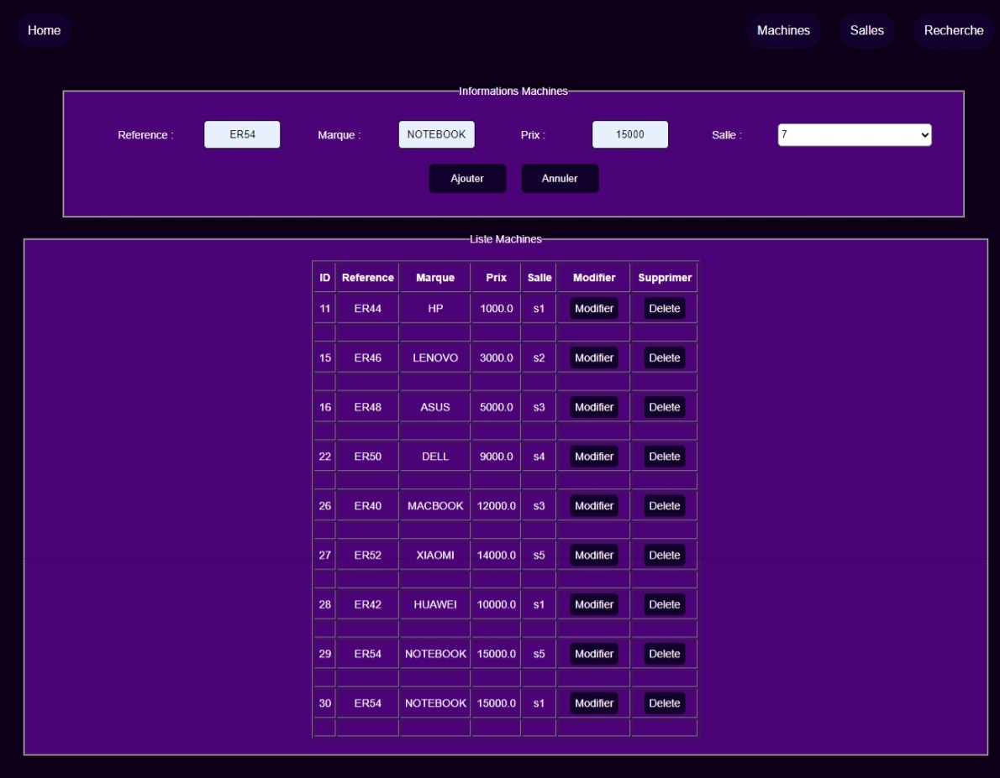

## Projet Java de Gestion de Salles et de Machines

- **Gestion des machines :**

- **Gestion des salles :**

- **Recherche des machines par salle :**

  
## les fonctionnalités implémentées
1. les operations CRUD pour les machines
3. trouver les machines existants

  
##Les Technologies Utilisées
+ MySQL
+ Hibernate
+ JSP

"# TP-JSP-Servlet"

#### Credit by Akhmim Abdelilah"
